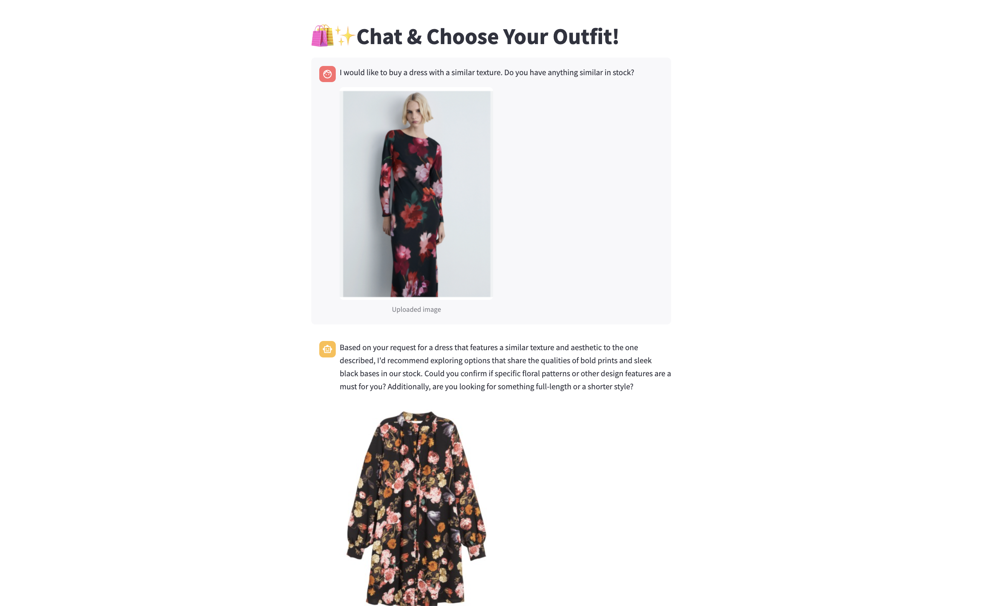
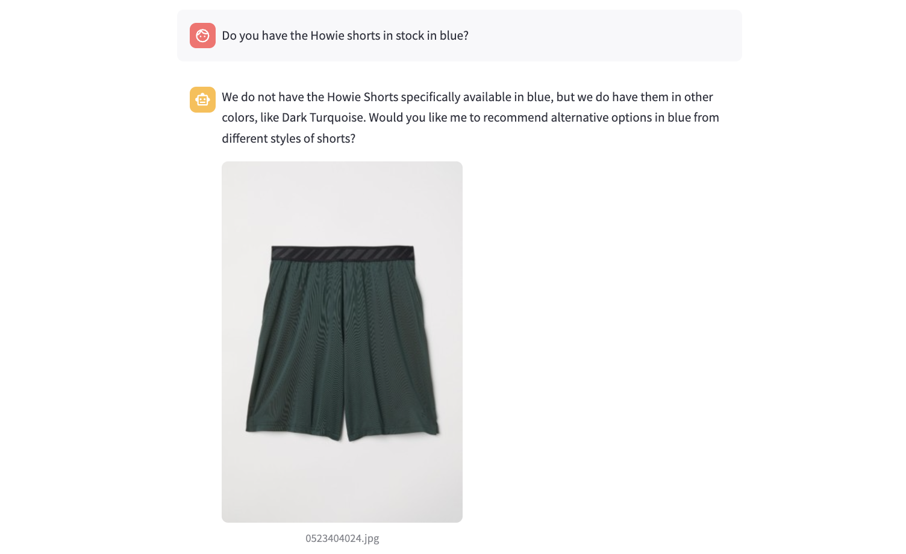

# 🛍️✨ Multimodal Retrieval-Augmented Generation for Fashion Recommendations

This repository implements a **Multimodal Retrieval-Augmented Generation (RAG)** system that delivers real-time 
**fashion recommendations** based on items currently in stock. It processes both **text and image inputs** to offer 
personalized product suggestions and visually returns relevant items, all within a responsive, user-friendly 
Streamlit interface.

## 🚀 Features
💬 **Natural Language & Image Chat**: Input both text queries and image uploads.  
🧠 **Multimodal Indexing**: Built with Chroma's vector store for both text and image embeddings.  
📊 **Question-Answering**: Context-aware recommendations using Retrieval-Augmented Generation (RAG).  
🎨 **Visual Feedback**: Returns fashion article images relevant to user queries.  
🛡️ **Topical Guardrails**: Prevent inappropriate content getting to the LLM by implementing input guardrails.  
🗂️ **Session-aware**: Each conversation thread is session-unique and maintains context.  
🧪 **Evaluation with LangSmith**: Track and evaluate assistant responses based on ground truth data and evaluation metrics.  

## 🧠 System Architecture
The solution employs a Retrieval-Augmented Generation (RAG) pipeline with built-in guardrails and multimodal input 
support. The architecture consists of three primary components:

**Indexing**: Processes and encodes items descriptions and metadata into numerical representations (embeddings) and stores them in an index for efficient retrieval.  
**Retrieval**: Handles user query, including both text and images, by retrieving the most relevant information from the index.  
**Generation**: Utilizes the LLM to generate relevant recommendations based on the user’s question and the top-k most relevant items retrieved from the index.  

The retrieval-generation step is orchestrated using a graph-based approach to make the system modular and extensible.

### Index (Vector Store)
The indexing component is responsible for processing and storing fashion items in a vector store, enabling efficient retrieval.

First, the dataset is loaded from a CSV file containing items with descriptions and metadata. Each item is processed 
to extract relevant information for indexing, such as product name, product type, colour and description, which 
are concatenated into a single string to form a comprehensive text representation of each item. Then, each text 
representation is converted into an embedding using a pre-trained language model from OpenAI (`text-embedding-3-large`).
Finally, the embeddings are stored in a vector store (Chroma) for efficient retrieval. Chroma can be used to store 
both text and image embeddings, allowing for multimodal queries. However, in this implementation, only text embeddings 
are used for indexing. In order to encode images, multimodal embeddings such as OpenAI's CLIP (ViT-g-14) can be used to
generate image embeddings.

### Retrieval
The first step in the retrieval process is to handle user queries, which can be either text or image-based.

If the query contains an image, this is transformed into a text representation using a multimodal model, such as OpenAI's
`gpt-4o`, which generates a description of the image. Then, the text query is combined with the text representation 
of the image to form a comprehensive query string. The latest chat history (i.e. last three messages) is also included 
in the query to provide context for the LLM, ensuring that the assistant can maintain a coherent conversation with the user.

The resulting query string is then processed to create an embedding using the same pre-trained language model used for 
indexing (`text-embedding-3-large`). Finally, the embedding is used to retrieve the most relevant items from the vector store
using cosine similarity, which ranks the items based on their relevance to the query.

### Generation with LLM and Topical Guardrails
The generation component uses a large language model (LLM) to generate personalized fashion recommendations based on the
retrieved items and the user query. 

First, the retrieved items are formatted into a comprehensive string that includes the product id, name, type, colour 
and description of each item. This string is then combined with the user query and the latest chat history to create a 
formatted input for the LLM. The model generates a response based on the structured output definition, which includes the
response message for the user and a list of recommended item IDs. This structured output is designed to allow for easy
integration with the Streamlit interface, where the response message is displayed to the user and the recommended item IDs
are used to fetch and display the corresponding product images.

The system also implements **topical guardrails** for the input queries to ensure that the conversation stays within the
fashion domain. This is done by implementing an asynchronous LLM call - which runs in parallel with the main LLM call for 
generating recommendations - that checks the user query against a set of predefined rules defined in the prompt (see 
`GUARDRAIL_PROMPT`). If the query is outside the fashion domain, the system returns a safe fallback response, which is 
defined in the configuration file, under the `GUARDRAIL_SAFE_RESPONSE` variable. This ensures that the assistant remains
focused on fashion-related topics and does not engage in inappropriate or off-topic discussions.

### Session Management
The system supports session-aware conversations, enabling users to engage in multiple interaction threads without losing
context. LangGraph allows for checkpointing the graph state - which includes both chat history and state variables - in a 
way that ties each thread to its own session. As a result, every conversation thread maintains a distinct context, 
isolated from others. A thread ID, specified in the graph run configuration, serves to identify the conversation and 
retrieve the associated state and history. This design also allows the configuration to be extended with customer 
metadata - such as gender, location, or preferences - to enable more personalized recommendations in future implementations.

## 🎨 User Interface
The user interface is built using Streamlit, providing a simple and intuitive way for users to interact with the system.
Users can input their queries in natural language or upload images of fashion items they are interested in. The
interface displays the generated recommendations, including product images, in a user-friendly format.

<figure>
  <p align="center">
    
  </p>
  <p align="center">Figure 1: Streamlit User Interface</p>
</figure>

## 📊 Evaluation
The system is evaluated using LangSmith, which allows for tracking and evaluating the assistant's responses based on
ground truth data and evaluation metrics. The evaluation process includes checking the relevance of the generated
recommendations based on the article ids returned by the LLM against the ground truth data.

The evaluation results can be visualized in LangSmith, providing insights into the system's performance and areas 
for improvement. This is a [toy example](https://smith.langchain.com/public/1afe88a2-1e49-416d-932b-dd560dbe1e14/d) 
to showcase the capabilities of LangSmith - more specifically datasets and experiments - and it is not representative 
of the system's performance. Future work can include adding more datapoints to the dataset and more comprehensive 
evaluation metrics.


## 💻 How to Run
### ✅ Prerequisites
1. Install dependencies:
```
pip install -r requirements.txt
```

2. Set up environment variables:
   - Open `.env` file in the root directory of the project.
   - Add the following variables to the `.env` file:
     ```
     AZURE_OPENAI_ENDPOINT=your-endpoint-here
     AZURE_OPENAI_API_KEY=your-api-key-here
     LANGSMITH_API_KEY=your-api-key-here
     ```

3. Prepare data:
   - Add your product dataset to `data/articles.csv`
   - Add images associated to the items in the dataset
     - Place images in the `data/images/` directory
     - Ensure that images are named according to their product IDs in the dataset

### 🏁 Run the Application

**Step 1: Build the Vector Store**
```
cd src
python indexing.py
```

**Step 2: Run the Streamlit app**
```
streamlit run streamlit_app.py 
```

## 📸 Example 
**User:** Do you have the Howie shorts in stock in blue? 

**Assistant:** We do not have the Howie Shorts specifically available in blue, but we do have them in other colors, 
like Dark Turquoise. Would you like me to recommend alternative options in blue from different styles of shorts?
<Howie Shorts in Dark Turquoise (Product ID: 0523404024)>

<figure>
  <p align="center">
    
  </p>
  <p align="center">Figure 2: Example</p>
</figure>

## 📚 Resources
- [Build a Retrieval Augmented Generation (RAG) App with LangGraph](https://python.langchain.com/docs/tutorials/rag/)
- [Chroma Integration with LangChain](https://python.langchain.com/docs/integrations/vectorstores/chroma/)
- [Multimodal Embeddings with OpenAI's CLIP](https://python.langchain.com/docs/integrations/text_embedding/open_clip/)
- [Guardrails Cookbook](https://cookbook.openai.com/examples/how_to_use_guardrails)
- [LangSmith Documentation](https://docs.smith.langchain.com/)
- [Streamlit Documentation](https://docs.streamlit.io/)

## 📈 Future Work
- **Multimodal Embeddings**: Implement image embeddings using OpenAI's CLIP for better image-text matching.
- **User Personalization**: Enhance recommendations with user-specific preferences and metadata (e.g. size, style).
- **Advanced Evaluation**: Expand datasets and evaluation metrics for more comprehensive performance analysis.
